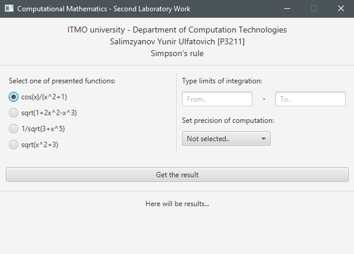

## Synopsis
There are presented 4 mathematical functions in program. 
User should select one of them, set limits of integration and set precision for Simpson rule computation. Program uses Runge rule to calculate tolerance.

#### Input:
* function
* lower and upper limits
* precision

#### Output: 
* Integral value
* Count of partitioning 
* Tolerance

**N.B.** If lower limit of integration >= upper limit, then integral should compute correctly

## Preview


## How-to-run
```
gradle run
```
